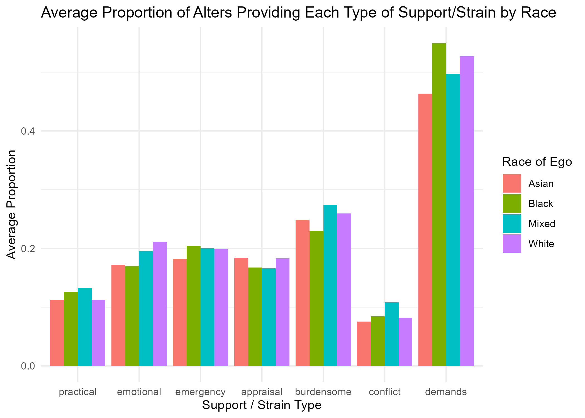
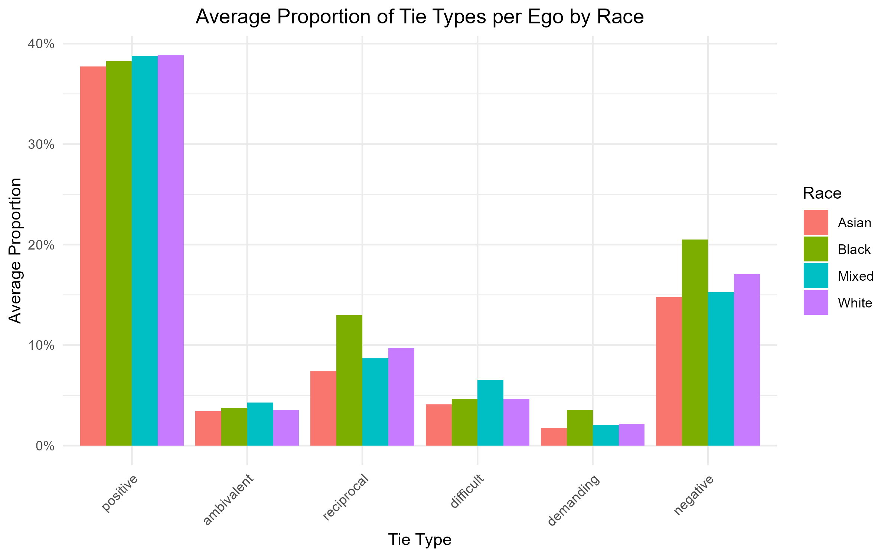
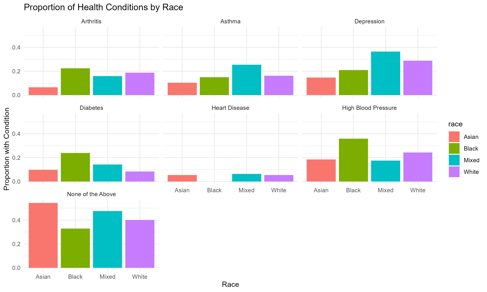

---
output:
  html_document:
    toc: false
    number_sections: false
    theme: default
---


## Exploring the Intersection of Multiplex Social Ties, Support Quality, and Racial Health Disparities
### Roberta Alidori


### Introduction

Social relationships are widely recognized as crucial determinants of health, yet not all ties exert uniformly positive effects. Particularly among race minority groups, social networks often carry both support and strain, which may contribute to health disparities. Although the literature has addressed the impact of supportive ties and social capital, the complexity of multiplex ties of social support that combine multiple support functions, remains underexplored. Understanding how multiplex social ties are distributed across racial groups and how they might shape health outcomes is crucial to uncover the social roots health inequalities across race groups. Tus, this project investigates the relationship between the multifaceted nature of ties of social support and health conditions, with a particular focus on to how these dynamics vary across race groups. 

### Theoretical Framework

This study draws on theories of social capital and social health inequalities. The concept of social support, particularly as it relates to health, remains the subject of ongoing theoretical debate and conceptual ambiguity. Despite its widespread use, social support is often conflated with other, network-related but distinct constructs such as social cohesion, social integration, social networks, and social capital (Song et al., 2014). The absence of clear conceptual boundaries has contributed to considerable heterogeneity in how social support is operationalised across studies, leading to inconsistencies in empirical findings regarding its health-related outcomes (Song et al. 2014). To bring greater clarity to this construct, I draw on a more synthetic and restrictive definition of social support - namely, the provision of tangible or intangible aid that individuals receive from and to members of their social networks. This definition serves several purposes. First, it narrows the focus to a specific relational content, distinguishing the concept of social support from broader structural features of social life, such as social cohesion or social integration. Moreover, it provides a clear basis for empirical measurement by isolating support as a discrete form of relational exchange in a network of relations. Second, it avoids formulations that assume only the protective effects of social support on health without first interrogating the mechanisms through which such effects may operate. This understanding complicates the conventional view of social support as a passive buffer and instead positions individuals as active participants within relational fields of mutual aid and obligation.

Regarding health inequalities, at its core, the term refers to systematic, avoidable, and unjust differences in health outcomes across population groups, often structured along dimensions such as socioeconomic status, race, immigration status, gender, and geography. Health inequalities are not simply variations in health; rather, they are patterned disparities that reflect and reproduce broader social and structural inequities. Health inequalities are produced and sustained by what Wilkinson and Marmot (2003) have termed the “social determinants of health”, that is, the conditions in which people are born, grow, live, work, and age, and the wider systems shaping the distribution of power, resources, and opportunities. Crucially, health inequalities are not only produced by material deprivation, but are also mediated by social relationships, including those formed within personal networks. Social support networks can buffer against the stressors associated with marginalization, promote access to health information and resources, and offer emotional and instrumental aid during illness. At the same time, social relationships may also be ambivalent, burdensome, or conflictual, particularly in contexts of constrained resources or intergenerational dependency. This makes the role of social support networks in health inequalities both significant and complex. These perspectives jointly inform the research questions and hypotheses regarding the relationship between tie types, health outcomes, and health inequalities.

### Research questions

This project has a dual aim. First, it seeks to investigate whether different dimensions of social support vary across racially diverse populations. Second, it explores whether such differences are associated with health inequalities between race groups.

The central research questions guiding this study are: 

**1.** Do ties of social support of different qualities vary across race groups?

**2.** Do these differences partly explain difference in health conditions? 

**3.** Do the associations between support ties and health outcomes differ by racial group? 

### Hypotheses

Based on the literature and theoretical considerations, four hypotheses guide the analysis:

**H1.** The quality of social support ties significantly differ across race groups, with race minority individuals reporting higher levels of ambivalent and demanding ties than White individuals.

**H2:** Differences in the quality of social support ties partly account for disparities in the number of health conditions reported.

**H3:** The association between support tie quality and health outcomes is moderated by race, such that the health impact of positive or negative ties varies across racial groups.


### Methodology

The analysis draws on data from Wave 1 of the Understanding How Personal Networks Change (UCNets) study. UCNets is a longitudinal study conducted by the University of California, Berkeley, designed to investigate how personal networks evolve over the life course and how these changes relate to health outcomes. Wave 1, conducted between May 2015 and January 2016, includes detailed information on respondents’ personal networks, demographic characteristics, life transitions, and health status, collected primarily through face-to-face interviews with a sample of adults aged 21–30 and 50–70 living in the San Francisco Bay Area. 

This analysis adopts a social network approach, focusing on *egocentric networks*. In an egocentric network, the *ego* refers to the focal individual, the respondent around whom the personal network is constructed. *Alters* are the individuals named by the ego as part of their social environment. The characteristics of these alters, and the types of relationships they maintain with the ego, form the basis for measuring network structure and support functions.The analysis was conducted in R using a combination of descriptive statistics, data transformation, and multivariate linear regression modeling.

The first step of this project involved measuring and examining their variation across four racial groups: White, Black, Asian, and Mixed race. These groups were identified based on their relatively high number of respondents (egos) in the dataset, ensuring sufficient statistical power for group comparisons. Tie-level support characteristics were derived based on the functions reported by egos about their alters in the UCNets survey. These included:

- **Practical support** (e.g., help with household tasks)

- **Emergency support** (e.g., help in case of injury) 

- **Emotional support** (e.g., someone to confide in) 

- **Appraisal support** (e.g., someone who gives advice)  

- **Conflictual relationships**  

- **Burdensome ties** (i.e., alters whom the ego helps frequently) 

- **Demanding ties** (i.e., alters likely to ask the ego for help)

Based on these indicators, additional composite variables were constructed to capture more complex tie-level characteristics:

- **Multiplex positive**: ties that provide two or more among practical, emergency, emotional, or appraisal support 

- **Multiplex negative**: ties characterized by conflict, burden, or demand 

- **Ambivalent ties**: ties that provide positive multiplex support and are simultaneously conflictual 

- **Reciprocal ties**: ties that are both positively supportive and demand support from the ego

- **Difficult ties**: conflictual ties that do not provide any form of positive support 

- **Demanding ties**: alters who are likely to ask for help but provide no support in return

These tie-level characteristics were then aggregated to the ego level, such as the percentage of ambivalent ties or the proportion of reciprocal ties in an individual’s network. Egos were grouped by race group and descriptive comparisons were made across these groups.

To assess health outcomes, an index of health conditions was constructed as the sum of the following self-reported conditions: high blood pressure, diabetes, heart disease, arthritis, asthma, and depression. After comparing the prevalence of these conditions across race groups, this health index was used as the dependent variable in multivariate models. The main independent variables included the network-level social support indicators described above.

Multivariate linear regression models were then estimated to examine the relationship between positive and negative multiplex ties and health outcomes, controlling for key sociodemographic variables such as age, gender, and education. The sociodemographic variables included in the models were selected based on both theoretical relevance and data availability. These variables are widely recognized in the literature as key social determinants of health, known to shape individuals' vulnerability to health conditions. In addition to their theoretical importance, these covariates were chosen because they had relatively low levels of missing data in the UCNets dataset. Other potentially relevant variables, such as income, were excluded from the analysis due to a high proportion of missing values, which would have significantly reduced the sample size and statistical power of the models In addition to modeling the main effects of positive and negative tie proportions, a second set of models was estimated to investigate whether more nuanced relational qualities, namely ambivalent, reciprocal, difficult, and demanding ties, relate and interact with race to shape health outcomes. The more specific ties of relation were included to assess whether the health consequences of these complex or asymmetric social ties vary across racial groups, beyond what is captured by general positive or negative tie categories.


### Results

The analysis reveals several key patterns. 

*Dimensions of social support*
First, in terms of  tie-level support characteristics reported by egos about their alters, descriptive results (see Figure 1.) reveal variation in the composition of social support networks across racial groups. White egos have the highest average proportion of emotional support ties (21%) and relatively high levels of emergency (20%) and appraisal support (18%). This may suggest that White respondents have greater access to emotionally supportive and information-relevant network members. Interestingly, respondents identifying as Mixed race report the highest proportion of practical support ties (13%) and are second only to White egos in emotional support (19%). However, they also exhibit the highest levels of burdensome ties (27%) and conflict ties (11%), suggesting a particularly complex relational profile. These findings point to a potentially ambivalent or dual nature of social ties within this group—relationships that may simultaneously provide support and generate strain. Black egos report the highest average proportion in emergency support (20%), and, at the same time, the highest proportion of alters demanding their help (54%). Respondents identifying as Asian exhibit a more moderate profile in their network composition. Their networks include relatively balanced levels of support: practical support (11.3%), emotional support (17.2%), and emergency support (18.2%). Notably, they report the lowest levels of burdensome (25%) and demanding ties (46%), and the lowest proportion of conflict ties (7.5%) among all groups. This pattern may indicate that Asian egos experience less relational strain in their networks compared to other racial groups. However, despite reporting lower levels of negative tie characteristics, they also show lower-than-average levels of emotional and appraisal support relative to White egos. This may suggest that while their networks are less conflictual or burdensome, they may not benefit from emotional and information. Overall, these findings highlight that not all support is equally distributed or experienced, as well they align with the idea that support quality is multidimensional.

```{r support-plot, echo=FALSE, fig.cap="Figure 1. Distribution of tie types by race group."}

```

<br>

Second, in terms of multidimensional tie indexes, the analysis (Figure 2.) reveals notable variation across racial groups, particularly in terms of positive and negative support dimensions. Overall, all four groups report comparable high proportions of positive ties, ranging from 37.7% among Asian egos to 38.8% among White egos. This indicates a relatively similarly high presence of emotionally and practically supportive relationships across groups. Ambivalent ties show a similar level of homogeneity across race groups. However, meaningful differences emerge in the distribution of negative ties, as well as in reciprocity and strain-related dynamics. Black egos exhibit the highest proportion of negative ties (20.5%), which include conflictual, demanding, and burdensome relationships. They also show elevated levels of demanding ties (3%) and reciprocal ties (12.9%), suggesting that while their networks are rich in mutual exchanges, they may also experience stronger norms of reciprocity and obligation, potentially increasing both the benefits and burdens of social ties. This dual nature may reflect dense relational environments where support and obligation coexist, which may in turn contribute to heightened stress and chronic strain. Mixed race respondents report the highest proportion of difficult ties (6.5%), alongside relatively low reciprocity (8.7%). Their networks display a particularly contrasting structure, in which practical and emotional support coexist with conflict. This suggests a more ambiguous or strained relational pattern, where ties may simultaneously support and challenge the ego's well-being. Such ambivalence may undermine the protective role of support and instead generate emotional exhaustion or role conflict. Asian egos stand out for having the lowest levels of negative (14.8%), reciprocal (7.4%), and demanding (1.8%) ties. These findings point to less strained and less demanding networks, which may reflect cultural norms emphasizing indirect exchange, or less emotionally intensive forms of support. Finally, White egos report the highest levels of reciprocal ties (9.7%), while maintaining lower levels of conflict (4.6%) and demanding ties (2.2%). This profile may reflect networks that are both supportive and balanced, where mutual help is more evenly distributed and negative dynamics are relatively contained. Overall, these results suggest that the quality, balance, and emotional tone of social support differ across race groups. Across diverse race groups, social networks have been found as both sources of support as well as strain, potentially having an impact on the health conditions of the egos. These dynamics underscore the importance of moving beyond simple measures of presence of support ties and considering the relational complexity and emotional texture of social ties in social network analysis and health research.

```{r tie-plot, echo=FALSE, fig.cap="Figure 2. Distribution of multidimensional tie indexes by race group."}

```

<br>

*Health conditions*

The distribution of health conditions across race groups (Figure 3.) reveals several noteworthy patterns. Overall, Black egos consistently report higher prevalence of most conditions compared to other groups in relation to arthritis, high blood pressure and diabetes, where their proportions are the highest among all racial categories. This aligns with existing literature on racial disparities in cardiovascular and metabolic conditions, often linked to structural stressors and unequal access to care. Notably, no Black respondents in the sample reported having been diagnosed with heart disease, as indicated by the absence of a bar for this group in the corresponding panel. While this may reflect a true absence of reported cases, it is also possible that the result stems from the relatively small number of Black egos in the dataset, limiting the ability to detect low-prevalence conditions. As such, this finding should be interpreted with caution, as it may reflect a sample size limitation rather than a genuine absence of disease within the population. Mixed race respondents exhibit relatively elevated levels of depression and asthma, with the highest proportions among all groups. This may suggest a heightened psycho-social burden or unmeasured stressors related to identity, discrimination, or network strain. Asian egos, in contrast, tend to report lower prevalence across most conditions, especially for arthritis, asthma, diabetes and depression. However, they show a notable proportion under "None of the Above", suggesting that many respondents in this group reported no chronic conditions among those listed. This pattern could indicate better baseline health but may also reflect differences in diagnosis rates, reporting practices, or access to health evaluations. White egos show moderate prevalence across most conditions, with proportions that are, however, generally higher than those of Asian egos. Their relatively elevated rates of arthritis, high blood pressure and depression suggest specific chronic burdens despite otherwise average health profiles. Taken together, these patterns suggest that race disparities in health conditions are evident in this sample and may intersect with differences in network support and strain structures described earlier. The elevated prevalence of health conditions among Black and Mixed race egos may help explain their greater exposure to negative, burdensome, and demanding ties, reinforcing the relevance of social ties quality in shaping health inequalities.

```{r g7-plot, echo=FALSE, fig.cap="Figure 3. Proportion of health conditions by race group."}

```

<br>

*Regression analysis: race, multiplex ties, health conditions*

The analysis is based on a linear regression model predicting the number of health conditions reported by each respondent. The model includes main effects for race, tie quality (multiplex positive and negative ties), gender, age group, and education level, along with interaction terms between race and both tie types. The model formula is as follows:

*Health Conditions* = β₀  
+ β₁ *(Race)*  
+ β₂ *(Proportion of Positive Ties)*  
+ β₃ *(Proportion of Negative Ties)*  
+ β₄ *(Gender)*  
+ β₅ *(Age Group)*  
+ β₆ *(Education Level)*  
+ β₇ *(Race × Positive Ties)*  
+ β₈ *(Race × Negative Ties)*  
+ ε

All categorical variables are treated as factors. The reference category for interpretation is:  
- *Race*: White  
- *Gender*: Male  
- *Age group*: 50–70  
- *Education level*: Medium

This means that all coefficients represent the difference in the number of health conditions relative to a White, male respondent aged 50–70 with medium educational level. Interaction terms indicate whether the effect of tie quality (positive or negative) differs across racial groups.

```{r model-table, echo=FALSE, message=FALSE, warning=FALSE}
library(here)
library(readr)
library(knitr)

model_table <- read_csv(here("outputs", "model_multiplex_raw.csv"))

kable(model_table, caption = "Table 1. Regression output: Multiplex ties, race and health")
```

The results of the multivariate linear regression model offer insights into how race and tie quality relate to the number of chronic conditions reported. The intercept (1.68, p < 0.001) represents the expected number of health conditions for the reference group. The coefficient for raceBlack (0.39) suggests that Black respondents have, on average, a higher number of chronic conditions compared to Whites, although this difference is not statistically significant at the 0.05 level (p = 0.0816). Neither Asian nor Mixed race respondents show statistically significant differences from Whites in the baseline number of health conditions. Negative ties (p_negative) are significantly associated with a higher number of health conditions (b = 0.56, p = 0.0458), supporting the idea that strain-based relationships are detrimental to health. Differently, positive ties (p_positive) do not show a significant association with health outcomes in the overall model (p = 0.78), suggesting that the presence of supportive ties alone may not be sufficient to reduce health conditions.

None of the interaction terms between race and tie quality reach statistical significance, though several suggest meaningful directions: the interaction between Black race and negative ties (b = –1.08) suggests that the health-damaging effect of negative ties may be less pronounced for Black respondents than for Whites, though this result is not statistically significant (p = 0.125). Conversely, the interaction between Mixed race and negative ties is positive (1.35), suggesting that negative ties may be more harmful for this group, though again not statistically significant (p = 0.294). None of the interactions involving positive ties are statistically significant, reinforcing the idea that the impact of supportive ties does not differ meaningfully by race in this model.

Importantly, interaction effects indicate that these associations are moderated by race. Among non-White egos, the presence of ambivalent ties shows a stronger association with chronic health conditions than among White egos. Similarly, demanding ties are more detrimental to health for racially minoritized individuals. Conversely, the presence of reciprocal ties appears to buffer these negative associations more effectively among White egos than among egos of color, suggesting differences in the meaning or consequences of reciprocity across groups. 

*Regression Analysis: race, tie types, health conditions*

The model estimates the number of health conditions as a function of race, tie type proportions (ambivalent, demanding, difficult, and reciprocal), sociodemographic variables, and interaction effects between race and tie types.

The model formula is as follows:

*Health Conditions* = β₀
+β₁ *(Race)*
+β₂ *(Proportion of Ambivalent Ties)*
+β₃ *(Proportion of Reciprocal Ties)*
+β₄ *(Proportion of Difficult Ties)*
+β₅ *(Proportion of Demanding Ties)*
+β₆ *(Gender)*
+β₇ *(Age Group)*
+β₈ *(Education Level)*
+β₉ *(Race × Ambivalent Ties)*
+β₁₀ *(Race × Reciprocal Ties)*
+β₁₁ *(Race × Difficult Ties)*
+β₁₂ *(Race × Demanding Ties)*
+ε

```{r model-table-themes, echo=FALSE, message=FALSE, warning=FALSE}
library(here)
library(readr)
library(knitr)

model_table <- read_csv(here("outputs", "model_themes_raw.csv"))

kable(model_table, caption = "Table 2. Regression output: Tie types, race and health")
```

In terms of main effects, the results indicate that, in terms of ambivalent ties, they are significantly and positively associated with the number of health conditions (b = 1.53, p = 0.0012), indicating that individuals with more ambivalent ties, i.e. those that provide both support and strain, are more likely to report poor health. Demanding, difficult, and reciprocal ties did not show significant main effects on health conditions.
Regarding interaction effects, the interaction between Mixed race and ambivalent ties is statistically significant and negative (b = –4.45, p = 0.0056), indicating that the positive association between ambivalent ties and health conditions is significantly weaker for Mixed race respondents compared to Whites. This suggests a negative pattern in how ambivalent support affects this group. The interaction between Black respondents and reciprocal ties is also statistically significant (b = –1.29, p = 0.0424), suggesting that reciprocal ties are associated with worse health outcomes in this group compared to Whites. While reciprocal ties are often considered beneficial, this result may reflect differences in how mutual expectations or obligations are experienced. No other interaction terms (e.g., between race and demanding or difficult ties) reach statistical significance, although some coefficients suggest potential patterns that could warrant further investigation.

### Discussion

This study examine how the quality of social support ties varies across race groups and how these differences relate to health conditions. Drawing on a multidimensional conceptualization of support that considers both its beneficial and burdensome aspects, the analysis reveals two key insights: (1) support networks differ systematically by race in both composition and quality, (2) these relational differences are associated with health outcomes, though the relationship between tie quality and health appears broadly similar across racial groups.

Consistent with Hypothesis 1 (H1), the results indicate that the quality of support networks varies significantly across race groups. While all groups report a high presence of positive ties, meaningful differences emerge in the distribution of reciprocal, difficult, and negative ties. For instance, Black respondents show elevated proportions of negative and reciprocal ties, while Mixed race respondents exhibit the highest levels of difficult ties. Differently, Asian respondents report relatively lower levels of relational strain but also fewer emotional and emergency supportive ties. These patterns point to differences not only in the quantity of support across race groups, but also in their emotional texture and relational complexity.

The results partly support Hypothesis 2 (H2): dimensions of support quality are linked to differences in health outcomes. In particular, multiplex negative ties, those that are associate with relations generating strain, are positively associated with the number of health conditions reported. These findings resonate with research on chronic stress, social role conflict, and emotional burden in relationships, suggesting that relational strain may undermine the protective functions of social support.

However, contrary to Hypothesis 3 (H3), the associations between support tie quality and health do not differ significantly by race in most cases. Although a few interaction terms reached statistical significance, such as between reciprocal ties and health for Black respondents, or between ambivalent ties and health for Mixed race egos, these were isolated effects rather than systematic moderation. Thus, while race groups differ in their exposure to particular types of support, the overall impact of tie quality on health appears broadly consistent across groups.

<div class="normal-text">

### Conclusion

These findings underscore the importance of considering not only the structure of social networks but also their functional quality. Rather than viewing support as universally protective, the study underscores that supportive relationships can also be sources of stress, particularly when they are demanding or emotionally contradictory. At the same time, the absence of strong moderation effects by race suggests that the relational mechanisms through which networks shape health may operate similarly across groups, even if exposure to different tie types is unequal. This distinction is crucial: while relational quality may not predict health by race in a different manner, the unequal distribution of supportive versus straining ties still represents a meaningful pathway through which social inequalities becomes embodied. This preliminary analysis contributes to the growing literature on the role of personal networks in producing and reproducing health inequalities. It highlights the need for more nuanced approaches that attend to the complexity of social ties. Future research should further explore the intersection of network structure, tie quality, and health inequality, ideally through mixed-methods designs that capture both statistical patterns and lived experiences.

</div>

### Bibliography:

Song, L., Son, J., & Lin, N. (2014). Social support. In J. Scott, P. J. Carrington (Eds.) *Social support* (pp. 116-128). SAGE Publications Ltd.

Wilkinson, R. & Marmot, M. (‎2003)‎. *Social determinants of health: the solid facts, 2nd ed.* World Health Organization. Regional Office for Europe.


---
